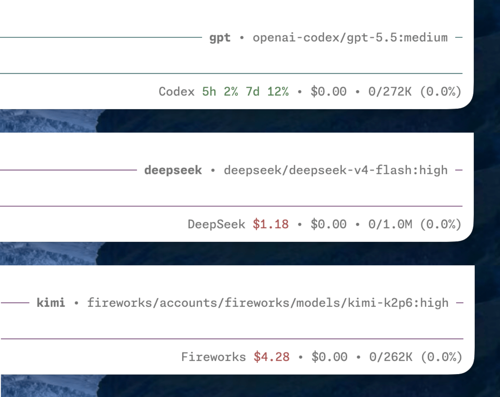

# pi-spark

[Pi](https://pi.dev/) package that polishes your daily experience and keeps you at the frontier of agentic workflows.


## Install

Install from npm:

```bash
pi install npm:pi-spark
```

Install from git:

```bash
pi install git:github.com/zlliang/pi-spark
```

## Features

### Compact TUI: editor, footer, and fullscreen

pi-spark ships with custom editor, footer, and fullscreen rendering, replacing the default ones. The compact TUI gives you a calm, immersive experience without distraction.

- The editor shows a working indicator inspired by [Amp](https://ampcode.com/) and the current model on the top border. If you use [presets](#presets), the active preset appears there too.
- The footer shows session information, extension statuses, cost, and context usage on one line.
- The fullscreen rendering clears the terminal screen and scrollback on session start and exit, and pins the editor and footer to the bottom.


### Credits

pi-spark shows the active provider's credit balance or rate-limit usage in the status line, so you can keep an eye on what's left without leaving the terminal.

- Supported providers: DeepSeek, Fireworks, Moonshot, OpenAI Codex, OpenRouter, and Vercel AI Gateway.
- Most provider fetching follows [CodexBar](https://github.com/steipete/codexbar). Fireworks is the exception: its balance sits behind an internal gRPC API, reverse-engineered from the `firectl` binary (see [docs/fireworks.md](./docs/fireworks.md)).



### Presets

pi-spark lets you define named model presets in `spark.json` (see [Configuration](#configuration)), so you can switch between models and thinking levels without retyping provider details. The active preset is shown on the editor's top border.

- Switch interactively with `/preset`, or jump straight to one with `/preset <name>`.
- Start pi on a given preset with `pi --preset <name>`.
- Cycle presets with `ctrl+super+p` (forward) and `ctrl+shift+super+p` (backward); `super` is `command` on macOS and needs a terminal that forwards it.


### Recap

pi-spark generates a short recap of the current session after it goes idle, or on demand, inspired by [Claude Code's session recap](https://code.claude.com/docs/en/interactive-mode#session-recap).

- A recap is generated automatically once the session stays idle past `recap.idle` in `spark.json`.
- Run `/recap` to generate one manually at any time.
- The recap can use its own model, configured separately from your working model.


## Configuration

pi-spark reads config from `~/.pi/agent/spark.json` and from the current project's `.pi/spark.json`. Project config overrides matching global fields.

For example:

```json
{
  "editor": {
    "spinner": "dots"
  },
  "footer": false,
  "presets": {
    "claude-opus": {
      "provider": "anthropic",
      "model": "claude-opus-4-8",
      "thinkingLevel": "high"
    },
    "gpt": {
      "provider": "openai-codex",
      "model": "gpt-5.5",
      "thinkingLevel": "medium"
    }
  },
  "recap": {
    "idle": "5m",
    "provider": "openai-codex",
    "model": "gpt-5.4-mini",
    "thinkingLevel": "off"
  }
}
```

### References

All fields are optional. Each top-level feature runs with the defaults below unless you [turn it off](#turn-off-the-features-you-dont-like).

| Field | Value (or `false`) | Description |
| --- | --- | --- |
| `credits` | `{}` | Shows the active provider's credit balance or rate-limit usage in the status line. |
| `editor` | `EditorConfig` | Shows a working indicator and the current model on the editor's top border. |
| `footer` | `{}` | Shows session info, extension statuses, cost, and context usage on one line. |
| `fullscreen` | `{}` | Clears the screen and scrollback on start and exit, and pins the editor and footer to the bottom. |
| `presets` | `{ [name]: Preset }` | Defines named model presets, keyed by name. |
| `recap` | `RecapConfig` | Generates a session recap when idle or on demand. |

#### `EditorConfig`

The `spinner` field is optional and defaults to `tildes`.

| Field | Value | Description |
| --- | --- | --- |
| `spinner` | `dots` | `⠋, ⠙, ⠹, ⠸, ⠼, ⠴, ⠦, ⠧, ⠇, ⠏` |
|  | `lights` | `○, ●` |
|  | `tildes` (default) | `∼, ≈, ≋, ≈, ∼` |
|  | `pulse` | `·, •, ●, •, ·` |

#### `Preset`

Each preset must set all three fields.

| Field | Value | Description |
| --- | --- | --- |
| `provider` | string | Provider ID, e.g., `anthropic`. |
| `model` | string | Model ID, e.g., `claude-opus-4-8`. |
| `thinkingLevel` | `ModelThinkingLevel` | Thinking level for the preset. |

#### `RecapConfig`

All fields are optional, including `thinkingLevel`. If the recap model configuration is incomplete, pi-spark falls back to the session's main model.

| Field | Value | Description |
| --- | --- | --- |
| `idle` | number (ms) or duration string | How long the session must stay idle before a recap is generated. Accepts a millisecond number or a [vercel/ms](https://github.com/vercel/ms) string (e.g., `"5m"`); minimum 5000 ms, defaults to 5 minutes. |
| `provider` | string | Provider ID for the recap model. |
| `model` | string | Model ID for the recap model. |
| `thinkingLevel` | `ModelThinkingLevel` | Thinking level for the recap model. |

#### `ModelThinkingLevel`

Valid values: `off`, `minimal`, `low`, `medium`, `high`, `xhigh`.

### Turn off the features you don't like

All features are enabled by default. Set a specific feature to `false` in `spark.json` to disable it.

For example, to disable the customized footer:

```json
{
  "footer": false
}
```
