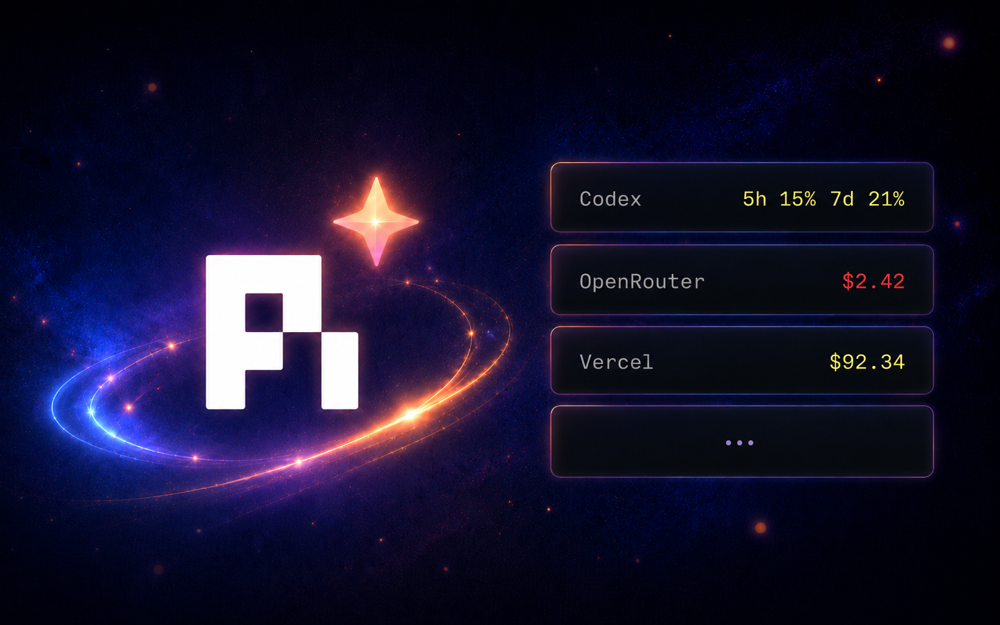
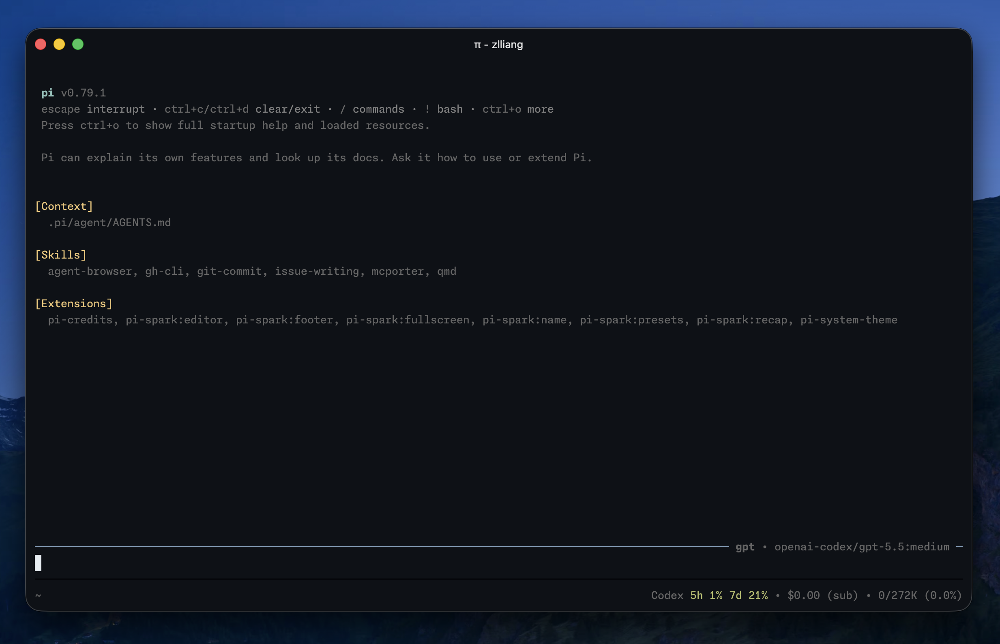

# pi-credits

A [pi](https://pi.dev/) extension that shows the active model provider's credit balance or rate-limit usage in the footer. It appears only for supported providers and uses the provider's stored credential or API key.



> Example with an OpenAI Codex subscription, paired with my [pi-spark](https://github.com/zlliang/pi-packages/tree/main/packages/pi-spark) package.

## Supported providers

- DeepSeek
- Fireworks
- Moonshot
- OpenAI Codex
- OpenRouter
- Vercel AI Gateway

Most provider-specific fetching approaches references [CodexBar](https://github.com/steipete/codexbar). Fireworks is an exception: its balance lives behind an internal gRPC API, so the approach was reverse-engineered from the `firectl` binary — see [docs/fireworks.md](./docs/fireworks.md).

## Install

Install from npm:

```bash
pi install npm:pi-credits
```

For local development from this monorepo:

```bash
pi install /path/to/pi-packages/packages/pi-credits
```

## Other pi packages

- [pi-spark](https://github.com/zlliang/pi-packages/tree/main/packages/pi-spark): a collection of pi extensions that polish the daily pi experience.
